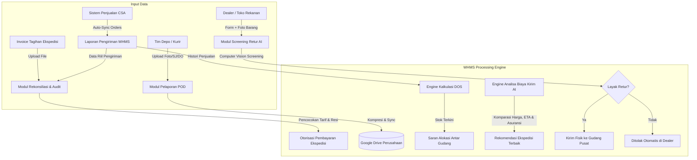

# WHMS - Warehouse & Logistics Management System
### Complete Selular • Ocean Space Logistics Platform

[](https://laravel.com)
[](https://php.net)
[](https://filamentphp.com)
[](https://laravel.com/docs/horizon)
[](https://laravel.com/docs/octane)
[](https://frankenphp.dev)
[](https://github.com/bezhanSalleh/filament-shield)

---

## 📌 Ringkasan Sistem (Overview)

**WHMS (Warehouse & Logistics Management System)** adalah platform terpusat yang dirancang untuk mengelola seluruh rantai operasional pergudangan dan logistik distribusi **Complete Selular / Ocean Space**.

Sistem ini menjembatani operasional fisik seluruh depo gudang dengan data transaksi penjualan sistem CSA (*Complete Selular Application*), audit finansial ekspedisi, optimalisasi perputaran stok (*Days of Sales/Stock*), serta otomasi kontrol mutu retur barang berbasis kecerdasan buatan (AI).

---

## 🚀 Fitur Utama & Ekspektasi Cara Kerja (Core Features & Workflows)

### 1. 🔍 Rekonsiliasi & Audit Invoice Ekspedisi (Freight Invoice vs Real Delivery Audit)
*Pencocokan data antara invoice penagihan dari ekspedisi vs real pengiriman all depo, dan validasi kepatuhan tarif yang disepakati antara pihak Ocean Space dan pihak ekspedisi.*

* **Cara Kerja & Mekanisme:**
  1. **Multi-Source Ingestion:** Sistem mengimpor data invoice digital/rekap dari pihak ekspedisi (nomor resi/AWB, tanggal pick-up, berat aktual, berat volumetrik, rute/depo asal-tujuan, biaya pengiriman, PPN, dan surcharge).
  2. **Automated Cross-Check (Matching):**
     * Memvalidasi apakah nomor resi/SJ benar-benar tercatat keluar dan berstatus terkirim dari depo yang bersangkutan.
     * Mendeteksi tagihan ganda (*duplicate billing*), resi fiktif, pengiriman dibatalkan (*cancelled deliveries*), atau pengiriman yang belum selesai (*undelivered*).
  3. **Rate Agreement Compliance (Audit Kontrak Harga):**
     * Sistem membandingkan tarif yang ditagihkan per kilogram/koli dengan *Rate Card Matrix* resmi yang telah disepakati antara Ocean Space dan ekspedisi.
     * Mengkalkulasi deviasi perhitungan berat (*actual vs volumetric weight markup*) dan mengidentifikasi selisih biaya (*variance discrepancy*).
  4. **Output Finansial:**
     * Menghasilkan status audit otomatis: **Matched (Sesuai)**, **Discrepancy (Selisih Tarif/Berat)**, atau **Unrecognized (Tidak Terdata)**.
     * Menjadi dasar persetujuan (*approval*) faktur oleh tim Finance sebelum pembayaran diterbitkan.

---

### 2. 📊 Sinkronisasi Otomatis Data Penjualan CSA ke Laporan Pengiriman (Automated CSA Logistics Logging)
*Pengisian laporan pengiriman di spreadsheet/database dari data penjualan sistem CSA secara otomatis agar tim gudang tidak mengisi manual dan tidak ada data yang terlewat.*

* **Cara Kerja & Mekanisme:**
  1. **Background Ingestion dari CSA:** Sistem secara terjadwal (melalui worker/queue atau webhook) menarik data pesanan/penjualan yang berstatus siap kirim dari sistem CSA.
  2. **Auto-Populate Laporan Pengiriman:**
     * Setiap pesanan otomatis dipetakan ke log pengiriman depo terkait: Nomor SO/DO, nama toko/pembeli/dealer, alamat tujuan, ekspedisi/kurir yang ditunjuk, jenis barang, dan kuantitas koli.
     * Menghilangkan proses input manual manual di Google Sheets/Excel oleh staf gudang yang rentan *human error*, terlambat diinput, atau tercecer.
  3. **Integritas Data Dasar Pembayaran:**
     * Laporan pengiriman otomatis ini terkunci sebagai *Single Source of Truth* logistik harian.
     * Menjadi data pembanding wajib (*baseline dataset*) saat ekspedisi menagihkan invoice di akhir periode.

---

### 3. 📦 Pelaporan Bukti Pengiriman (POD) & Arsip Cloud Drive Terpusat (Unified POD & PO Receipt Archive)
*Report hasil pengiriman dan penerimaan PO (foto penerima, SJ bertanda tangan/stempel, dan foto DO) dilaporkan dalam 1 aplikasi terintegrasi dan diarsipkan otomatis ke Google Drive perusahaan.*

* **Cara Kerja & Mekanisme:**
  1. **Mobile-Friendly Submission Form:**
     * Driver, kurir, atau staf gudang depo mengambil dan mengunggah bukti pengiriman langsung melalui aplikasi:
       * 📷 Foto penerima barang di lokasi tujuan.
       * 📝 Foto Surat Jalan (SJ) fisik yang telah ditandatangani dan distempel pihak penerima.
       * 📋 Foto Delivery Order (DO) / Purchase Order (PO) penerimaan barang.
  2. **Automated Cloud Storage Sync:**
     * Sistem memproses kompresi gambar, menandai metadata (geolokasi, timestamp, no transaksi), dan mengunggahnya secara asinkron ke Google Drive / Cloud Storage perusahaan.
     * Folder diorganisir secara rapi dan dinamis:
       ```text
       Google Drive/
       └── Ocean_Space_Logistics/
           └── Depo_Bandung/
               └── 2026/
                   └── 09-September/
                       └── SJ-202609001_PO-8891/
                           ├── foto_penerima.jpg
                           ├── sj_signed.pdf
                           └── do_penerimaan.jpg
       ```
  3. **Akses Cepat untuk Klaim & Audit:** Tim operasional, audit, dan customer service dapat langsung melihat lampiran dokumen POD langsung dari dashboard detail pesanan tanpa perlu mencari dokumen fisik.

---

### 4. 📈 Rekomendasi Alokasi Stok Antar-Gudang Berbasis DOS (Inter-Warehouse Stock Allocation Engine)
*Rekomendasi alokasi stok antar-gudang dengan memperhitungkan stok fisik terkini, tren penjualan, dan Days of Sales/Stock (DOS) per masing-masing gudang/depo.*

* **Cara Kerja & Mekanisme:**
  1. **Metrik Perhitungan Real-Time:**
     $$\text{Daily Sales Velocity (DSV)} = \frac{\text{Total Penjualan } N \text{ Hari Terakhir}}{N}$$
     $$\text{Days of Stock (DOS)} = \frac{\text{Stok Tersedia Saat Ini}}{\text{Daily Sales Velocity (DSV)}}$$
  2. **Analisa Keseimbangan Stok Multi-Depo:**
     * Mengidentifikasi depo yang mengalami **Overstock / High DOS** (barang mengendap, risiko deadstock).
     * Mengidentifikasi depo yang berada dalam zona **Stockout Risk / Critical DOS** (potensi kehilangan omzet).
  3. **Smart Mutation/Transfer Suggestion:**
     * Sistem menghitung jumlah alokasi transfer unit optimal dari depo surplus ke depo defisit.
     * Mempertimbangkan lead time pengiriman antar-gudang dan kapasitas buffer stock gudang tujuan.
     * Menghasilkan draft instruksi transfer antar-gudang (*Internal Transfer Request*) yang siap disetujui manajer logistik.

---

### 5. 🤖 Analisa & Rekomendasi Biaya Kirim Berbasis AI (AI-Powered Carrier & Rate Optimization)
*Analisa biaya kirim dengan membandingkan harga antar ekspedisi, estimasi waktu tempuh (ETA), dan asuransi barang bernilai tinggi; AI menyarankan opsi ekspedisi terbaik, termurah, dan tercepat.*

* **Cara Kerja & Mekanisme:**
  1. **Multi-Carrier Parameter Comparison:**
     * Membandingkan tarif dasar ongkir per zona/kota tujuan dari berbagai rekanan ekspedisi (J&T, JNE, SiCepat, Wahana, Cargo, dll.).
     * Menghitung premi asuransi barang bernilai tinggi (gadget/smartphone/elektronik) berdasarkan deklarasi nilai barang.
     * Mengkalkulasi estimasi waktu tempuh (*Estimated Time of Arrival - ETA*).
  2. **AI Decision Matrix Scoring:**
     * AI mengevaluasi trade-off antara biaya total (ongkir + asuransi + handling fee) dan kecepatan kirim (SLA).
     * Menampilkan rekomendasi berlabel jelas pada dashboard admin/sales:
       * 🟢 **Rekomendasi Terbaik (Best Value):** Keseimbangan optimal biaya vs durasi aman.
       * 🏷️ **Paling Ekonomis (Cheapest Option):** Biaya terendah (ideal untuk pengiriman partai besar non-urgent).
       * ⚡ **Paling Cepat (Fastest ETA):** Prioritas kecepatan untuk pesanan bernilai tinggi atau urgent.
  3. **Simulasi & Transparansi Biaya:** Memberikan rincian rinci breakdown tambahan biaya sebelum pengiriman diproses ke kurir.

---

### 6. 📱 AI Screening & Pre-Approval Kelayakan Retur Dealer (AI Dealer RMA Verification)
*Screening barang retur oleh dealer secara mandiri; dealer mengisi formulir dan melampirkan foto kondisi fisik, AI mengevaluasi kelayakan retur sebelum barang dikirim ke gudang pusat.*

* **Cara Kerja & Mekanisme:**
  1. **Self-Service Return Form oleh Dealer:**
     * Dealer mengisi form klaim retur: Nomor Faktur/IMEI/Serial Number, kategori kendala (dead on arrival, cacat kosmetik, salah barang, gagal fungsi), serta catatan keluhan.
     * Mengunggah foto wajib: Foto unit tampak depan/belakang, foto sudut/bazel, foto nomor seri/IMEI pada kemasan & bodi, serta foto segel garansi.
  2. **AI Computer Vision Inspection:**
     * Model AI menganalisis gambar untuk mendeteksi:
       * Tanda-tanda kerusakan akibat kelalaian pemakaian (*human error* seperti layar retak, bekas benturan, korosi/kena cairan).
       * Integritas segel garansi resmi (utuh, robek, atau indikasi dibongkar pihak luar).
       * Kesesuaian fisik model dan label IMEI dengan data pembelian awal.
  3. **Keputusan Pre-Approval Sebelum Pengiriman Fisik:**
     * **Layak Retur (Approved for Shipment):** Dealer diberikan nomor RMA dan instruksi pengiriman ke gudang pusat.
     * **Ditolak di Awal (Pre-Screening Rejected):** Sistem memberikan penjelasan visual alasan penolakan (misal: "Segel rusak" atau "Indikasi benturan/LCD pecah bukan garansi distributor").
     * **Manfaat:** Mencegah dealer mengirimkan barang yang pasti ditolak saat tiba di gudang, menghilangkan sengketa retur, serta menghemat beban ongkos kirim retur yang sia-sia.

---

## 🏗️ Arsitektur & Status Codebase Saat Ini (Current Architecture)

Repositori ini dibangun menggunakan pondasi arsitektur modern berbasis Laravel dan Filament ecosystem:

| Komponen | Spesifikasi & Paket | Keterangan |
| :--- | :--- | :--- |
| **Framework Backend** | [Laravel 13.x](file:///Users/apriansyahrs/Documents/Code/complete_selular/whms/composer.json#L12) + PHP 8.4 | Performa tinggi, native types, dan arsitektur enterprise |
| **Admin Panel Engine** | [Filament v5.x](file:///Users/apriansyahrs/Documents/Code/complete_selular/whms/composer.json#L11) | Panel manajemen back-office yang reaktif dan dinamis |
| **Panel Provider** | [AdminPanelProvider.php](file:///Users/apriansyahrs/Documents/Code/complete_selular/whms/app/Providers/Filament/AdminPanelProvider.php) | Admin interface (`/admin`) dengan navigasi terintegrasi |
| **Role & Permission (RBAC)**| [Filament Shield](file:///Users/apriansyahrs/Documents/Code/complete_selular/whms/composer.json#L10) | Otorisasi hak akses granular berbasis role dan permission |
| **Application Server** | [Laravel Octane](file:///Users/apriansyahrs/Documents/Code/complete_selular/whms/config/octane.php) + FrankenPHP | High-performance server runner & worker concurrency |
| **Asynchronous Job / Queue**| [Laravel Horizon](file:///Users/apriansyahrs/Documents/Code/complete_selular/whms/composer.json#L13) | Manajemen antrean worker (sync CSA, upload Drive, komputasi DOS) |
| **Log Monitoring** | [Opcodes Log Viewer](file:///Users/apriansyahrs/Documents/Code/complete_selular/whms/composer.json#L15) | Pemantauan error log sistem langsung dari antarmuka web |
| **User Impersonation** | [Filament Impersonate](file:///Users/apriansyahrs/Documents/Code/complete_selular/whms/composer.json#L16) | Fitur pengujian dan peniruan sesi user untuk mempermudah audit operasional |

---

## 🗄️ Entitas & Skema Data Utama (Data Model Roadmap)

```text
├── Warehouses / Depots (Daftar gudang/depo cabang Ocean Space)
├── Expeditions & RateCards (Master ekspedisi, zona tujuan, tarif berat/volume, asuransi)
├── CsaSalesOrders (Data tarikan penjualan dari sistem CSA)
├── ShipmentDeliveries (Laporan pengiriman riil per depo, nomor resi, kurir, status)
├── DeliveryProofs (Lampiran POD: foto penerima, SJ ttd, DO, link Google Drive)
├── FreightInvoices & AuditItems (Tagihan invoice ekspedisi, hasil rekonsiliasi, selisih biaya)
├── StockInventories & SalesVelocities (Stok fisik, histori penjualan, kalkulasi DOS depo)
├── InterWarehouseTransfers (Rekomendasi dan riwayat mutasi/transfer stok antar gudang)
└── DealerReturns & AiScreeningLogs (Pengajuan klaim retur dealer, foto unit, hasil analisis AI)
```

---

## 🔄 Alur Integrasi Sistem (System Workflow Diagram)



---

## 👥 Matriks Hak Akses Pengguna (Role-Based Access Control)

Melalui **Filament Shield**, akses fitur dibagi secara hierarkis:

1. **Super Admin / Management:** Akses menyeluruh ke seluruh modul, konfigurasi tarif, monitoring Horizon, dan Log Viewer.
2. **Finance & Accounting Logistik:** Akses ke audit invoice ekspedisi, persetujuan pembayaran, dan laporan selisih biaya.
3. **Depo Warehouse Staff / Admin Gudang:** Mengakses order pengiriman CSA, mengunggah bukti POD (foto, SJ, DO), dan menerima transfer stok.
4. **Logistics & Inventory Planner:** Mengakses analisis perputaran stok (DOS), rekomendasi transfer antar-depo, dan rekomendasi pemilihan ekspedisi.
5. **Dealer / Mitra Retail:** Akses portal terbatas pengajuan klaim retur barang dan pemantauan status RMA.

---

## 🛠️ Panduan Instalasi & Menjalankan Proyek (Getting Started)

### Kebutuhan Sistem (Prerequisites)
* **PHP:** >= 8.3 (Disarankan PHP 8.4)
* **Composer:** 2.x
* **Node.js & NPM:** Node.js 20+
* **Database:** SQLite (lokal dev) atau MySQL/PostgreSQL (staging/produksi)
* **Redis Server:** (Wajib untuk Laravel Horizon & asynchronous queues)

### Langkah Setup Lokal

1. **Clone repositori dan masuk ke direktori proyek:**
   ```bash
   git clone <repository_url>
   cd whms
   ```

2. **Install dependensi PHP & JavaScript:**
   ```bash
   composer install
   npm install
   ```

3. **Konfigurasi Environment:**
   ```bash
   cp .env.example .env
   php artisan key:generate
   ```

4. **Jalankan Migrasi Basis Data & Setup Role Permission:**
   ```bash
   php artisan migrate
   php artisan shield:install --fresh
   ```

5. **Buat User Super Admin:**
   ```bash
   php artisan make:filament-user
   ```

6. **Build Aset Frontend & Jalankan Server:**
   ```bash
   # Terminal 1: Vite asset builder / watcher
   npm run dev

   # Terminal 2: High-Performance Octane Server (FrankenPHP)
   php artisan octane:start --watch
   # Atau server standar: php artisan serve

   # Terminal 3: Laravel Horizon (Queue worker)
   php artisan horizon
   ```

7. **Akses Dashboard:**
   * **Admin Panel:** [http://localhost:8000/admin](http://localhost:8000/admin)
   * **Laravel Horizon:** [http://localhost:8000/horizon](http://localhost:8000/horizon)
   * **Log Viewer:** [http://localhost:8000/log-viewer](http://localhost:8000/log-viewer)

---

## 📜 Lisensi & Konvensi Pengembangan

Proyek ini dikembangkan secara internal untuk **PT Complete Selular / Ocean Space**.  
Pengembangan kode mengikuti standar PSR-12 dan Laravel Code Conventions yang diformat menggunakan [Laravel Pint](https://laravel.com/docs/pint):
```bash
vendor/bin/pint --dirty --format agent
```
